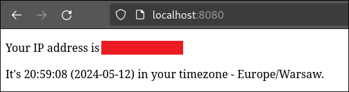
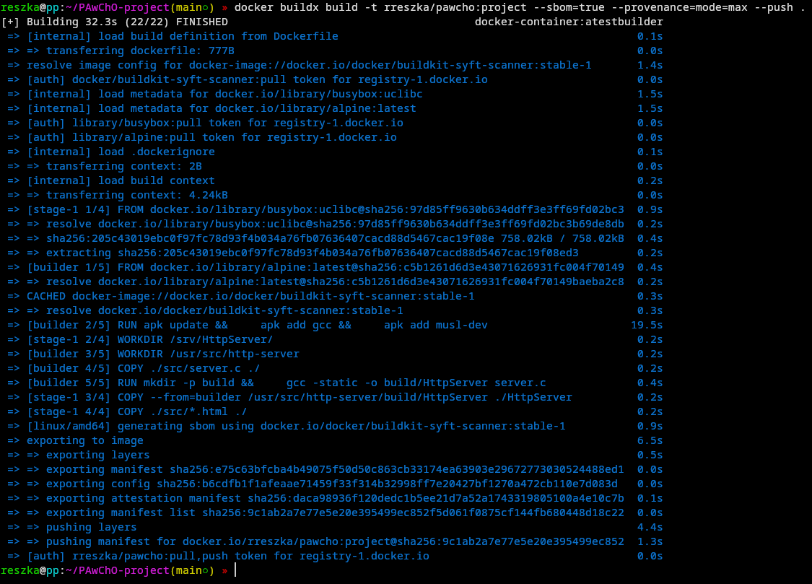
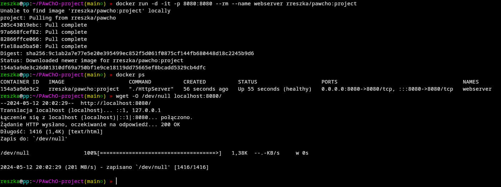
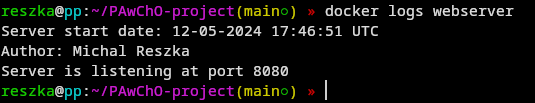
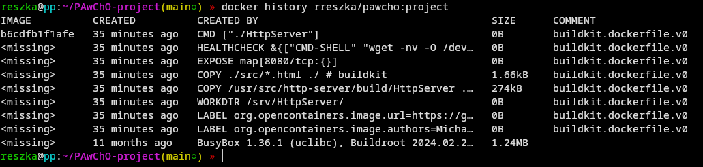
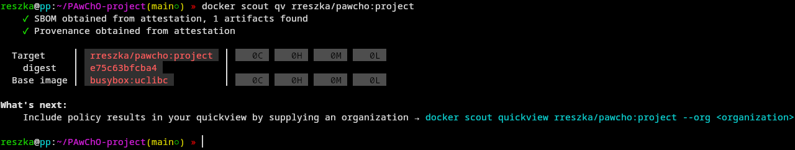
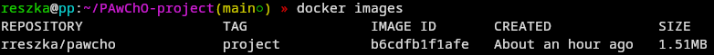

# Project for PAwChO LAB

This project has been made as a verification of knowledge gained from previous labs. In addition, it takes part in a competition for the smallest image that meets the requirements of class instructor's tasks.

## Obligatory part of the project

### Web server

Due to the fact that I wanted to take a part in competition on the size of the image, I decided to write it in C (learning from [this video](https://www.youtube.com/watch?v=2HrYIl6GpYg)). It is very primitive, but should be enough for requirements of this project. This server shares static HTML page, which shows user's public IP, and time equivalent to his timezone (also based on gathered IP).



### Dockerfile

I wrote a Dockerfile, that compiles the source file of my web server and copies it to the final stage where it's launched. It also has a health check for server status supervising and labels giving me as an author of this image and a link to this repository.
I confess to not clearing cache after packages installation but that's because it doesn't affect the final stage. 

### Commands

#### Building an image: 

```sh
docker buildx build -t rreszka/pawcho:project --sbom=true --provenance=mode=max --push .
```



#### Running a container:

```sh
docker run -d -it -p 8080:8080 --rm --name webserver rreszka/pawcho:project
```



#### Checking container logs:

```sh
docker logs webserver
```



#### Checking image layers:

```sh
docker history rreszka/pawcho:project
```



### Regarding the competition

To be able to participate, created image must not have any high or critical vulnerabilities detected by Docker Scout. Well, it wasn't really hard to achieve in my case, as I don't use too much packages.



I think that achieved size of my image is satisfying. It could be even smaller if I built it from scratch (thanks to the usage of static linking option in gcc it would actually work), but I preferred BusyBox, because it already had lightweight version of wget, which was useful for server health checks. Among many BusyBox images, I chose the one with uclibc, because it was the lightest.

My image is available [here](https://hub.docker.com/r/rreszka/pawcho/), while the screenshot with the size of this image stored locally is below:

