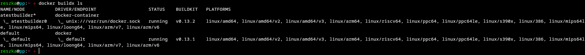
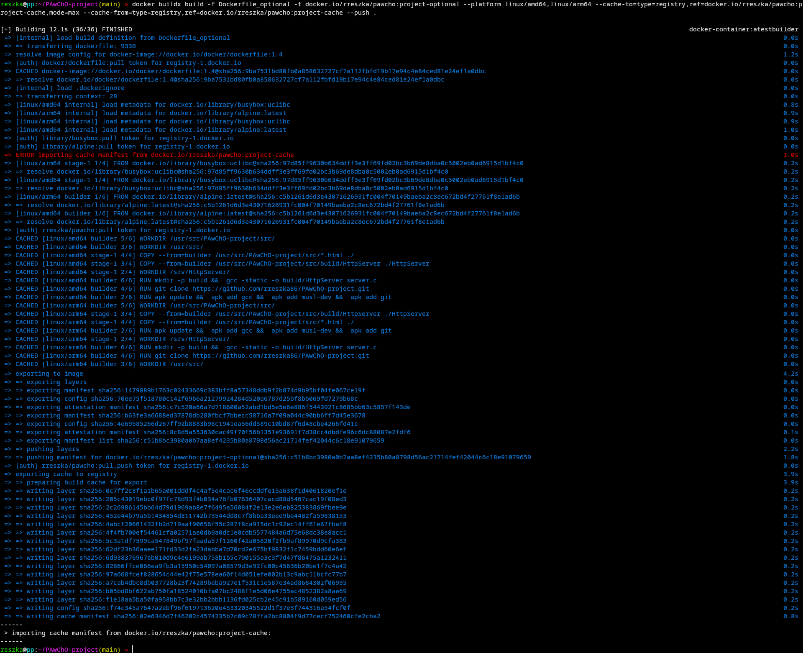
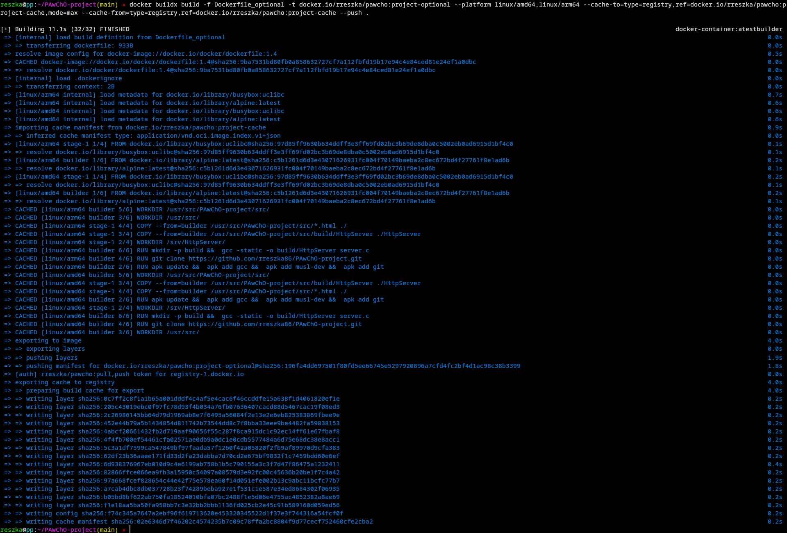
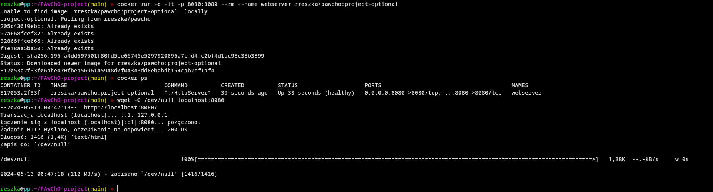

# Optional part of this exercise

In this part, I modified original Dockerfile, naming it Dockerfile_optional. New file contains definition of frontend (version 1.4). It also clones this repository (with usage of HTTPS protocol) during the first stage.

### Usage of builder with docker-container driver

I already had active builder using required driver after labs (and I had installed QEMU back then):



If I needed to create a new builder, I would use this command:

```sh
docker buildx create --name builder_name --driver docker-container --use --bootstrap
```

### Building an image with cache import & export

Command provided below builds an image with cache importing & exporting. It also builds it for multiple platforms: AMD64 and ARM64.

```sh
docker buildx build -f Dockerfile_optional -t docker.io/rreszka/pawcho:project-optional --platform linux/amd64,linux/arm64 --cache-to=type=registry,ref=docker.io/rreszka/pawcho:project-cache,mode=max --cache-from=type=registry,ref=docker.io/rreszka/pawcho:project-cache --push .
```

First run with this command shows an error while importing cache (which was expected as there is no cache available yet):



In the second run error didn't show up, because cache was imported with previous launch:



### But does it still work?

Yes, of course.

